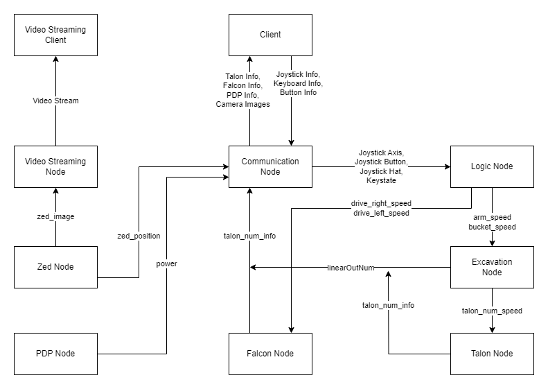

# Welcome to the Razorbotz NASA Lunabotics Project!
This page is intended to provide a starting point and overview of the project.  It is also a roadmap for how to get involved with the project, even if you aren't familiar with the code or technology stack. Please note that these links may not be up to date and any links should be followed at your own risk.  If you find any links that no longer work or changes that need to be made, please contact me at andrewburroughs17@gmail.com.  Click [here](https://razorbotz.github.io/ROS2/) to view the documentation for the project.  If you are not familiar with Github and the git cli, please refer to the [Razorbotz Github Intro page](https://github.com/Razorbotz/Test).

## Overview
* [Getting Started](#getting-started)
* [Building the Workspace](#building-the-workspace)
* [Launching the Robot](#launching-the-robot)
* [Running on Hardware](#running-on-hardware)
* [Running the Simulation](#running-the-simulation)
* [Launch Argument Reference](#launch-argument-reference)
* [What Gets Launched](#what-gets-launched)
* [Understanding the Codebase](#understanding-the-codebase)
* [Troubleshooting](#troubleshooting)

---

## Getting Started
To get started with the project, install the [virtual machine](https://github.com/Razorbotz/Install). Then after installing the virtual machine, go through these [Linux tutorials](https://www.hostinger.com/tutorials/linux-commands). The key objective of these tutorials is to teach how to navigate through the file structure via the terminal, as well as manipulating files using commands. Because the robot is designed to be operated remotely on the lunar surface, understanding these commands is an essential skill for this project.

The robot software in this repo runs on the robot's onboard computers (Jetson Orin / Jetson Nano) or in simulation. The operator station that drives the robot is the **control program**, which lives in the [CPP repo](https://github.com/Razorbotz/CPP) and has its own README.

---

## Building the Workspace
The project uses **ROS2 Humble** on Ubuntu 22.04. If ROS isn't installed yet, follow the [Humble install guide](https://docs.ros.org/en/humble/Installation/Ubuntu-Install-Debs.html). Add ROS to every new terminal by putting this in your `~/.bashrc`:

```bash
source /opt/ros/humble/setup.bash
```

Then install the extra packages the launch files use:

```bash
sudo apt install python3-colcon-common-extensions \
    ros-humble-foxglove-bridge ros-humble-realsense2-camera
```

The simulation also needs Gazebo. RealSense is only required on Talos and Sierra hardware, and Foxglove Bridge only if you launch with `use_foxglove:=true`.

The workspace root is the `shovel` folder; it contains `launch.py`, `launch/`, and `src/`. Build from there:

```bash
cd ~/SoftwareDevelopment/ROS2/shovel
colcon build
source install/setup.bash
```

To rebuild a single package while you work on it, use `colcon build --packages-select <package>` (for example `colcon build --packages-select logic`).

Run `source install/setup.bash` in **every new terminal** before running any `ros2` command, and rebuild after changing any C++ code.

---

## Launching the Robot
Everything starts from a single launch file, `launch.py`, at the workspace root. The `robot` argument selects which configuration to run:

```bash
ros2 launch . launch.py robot:=talos      # Talos hardware (default)
ros2 launch . launch.py robot:=sierra     # Sierra hardware
ros2 launch . launch.py robot:=sisyphus   # Sisyphus hardware
ros2 launch . launch.py robot:=sim        # Gazebo simulation
```

> **Important:** Run this from the workspace root. `launch.py` finds its sub-launch files with `os.getcwd()`, so it looks for `./launch/launch_*.py` relative to wherever you are. Launching from another directory will fail to find them.

The `robot` argument decides:
* which motor configuration is loaded,
* whether Gazebo is started,
* the communication node's role and network interface,
* which peripherals (lidar, RealSense, AprilTag) are started.

---

## Running on Hardware

### On the robot
SSH into the robot's onboard computer, then:

```bash
cd ~/SoftwareDevelopment/ROS2/shovel
source install/setup.bash
ros2 launch . launch.py robot:=sierra
```

If you are running on the Jetson Nano instead of the Orin, set the communication role:

```bash
ros2 launch . launch.py robot:=sierra role:=nano
```

On hardware the communication and video nodes use the Wi-Fi interface `wlP1p1s0`. Lidar and, for Talos/Sierra, the RealSense D415 camera are started automatically.

### On the operator laptop
Start the control program from the CPP repo and connect to the robot. The default IPs are `192.168.0.6` for the Orin and `192.168.0.5` for the Nano. Use the bot flag that matches the robot; see the CPP README for the full list.

### Useful options on hardware
```bash
# Bring up everything except the motor controllers (e.g. bench testing sensors)
ros2 launch . launch.py robot:=sierra use_motors:=false

# Skip the perception node
ros2 launch . launch.py robot:=sierra use_perception:=false

# Don't record a telemetry bag file this run
ros2 launch . launch.py robot:=sierra enable_recording:=false

# Start the Foxglove bridge for live visualization (port 8765)
ros2 launch . launch.py robot:=sierra use_foxglove:=true
```

---

## Running the Simulation
The simulation runs the same autonomy, logic, communication, drivetrain, and video nodes as the real robot, with Gazebo and simulated motors in place of the hardware.

### 1. Start the simulation
In a WSL terminal:

```bash
cd ~/SoftwareDevelopment/ROS2/shovel
source install/setup.bash
ros2 launch . launch.py robot:=sim
```

This single command starts Gazebo (`artemis_sim.launch.py`), the simulated motors, AprilTag detection and localization, and all the shared robot nodes. You no longer need to launch `artemis_sim.launch.py` separately.

In simulation the communication node runs with `role:=sim` and `local:=true`, so it talks to an operator station on the same machine. It and the video node use the network interface `eth1`; if your WSL interface has a different name (check with `ip a`), see [Troubleshooting](#troubleshooting).

### 2. Drive it
**With the control program** (recommended, same GUI as competition): in the CPP repo's `build/` folder run

```bash
./control --wsl
```

`--wsl` points the control program at `127.0.0.1` so it connects to the simulated robot. Click **Connect** and drive with a joystick or controller as usual.

**With the keyboard teleop node:** in a second terminal

```bash
cd ~/SoftwareDevelopment/ROS2/shovel
source install/setup.bash
ros2 run teleop keyboard_control
```

### 3. Visualize (optional)
Add `use_foxglove:=true` to stream ROS topics to [Foxglove Studio](https://foxglove.dev/) at `ws://localhost:8765`. The control program also runs its own Foxglove server on port 8765, so if both run on the same machine start the control program with `--disable_foxglove`.

---

## Launch Argument Reference

| Argument | Default | Values | Description |
|---|---|---|---|
| `robot` | `talos` | `talos`, `sierra`, `sisyphus`, `sim` | Robot configuration to launch |
| `role` | `orin` | `orin`, `nano` | Communication node role on hardware (forced to `sim` when `robot:=sim`) |
| `use_motors` | `true` | `true`, `false` | Launch the motor controller nodes |
| `use_perception` | `true` | `true`, `false` | Launch the lunar perception node |
| `use_foxglove` | `false` | `true`, `false` | Launch Foxglove Bridge on port 8765 |
| `enable_recording` | `true` | `true`, `false` | Record telemetry to a bag file for post-run analysis |
| `print_data` | `false` | `true`, `false` | Verbose logging (declared but not currently passed to any node) |

---

## What Gets Launched

| Component | Launch file | Talos | Sierra | Sisyphus | Sim |
|---|---|:-:|:-:|:-:|:-:|
| Gazebo | `artemis_sim.launch.py` | | | | ✓ |
| Motors | `launch_talos_motors.py` / `launch_sierra_motors.py` / `launch_motors.py` (sim) | ✓ | ✓ | ✓ ¹ | ✓ |
| Perception | `perception` package | ✓ | ✓ | ✓ | ✓ |
| Autonomy | `launch_autonomy.py` | ✓ | ✓ | ✓ | ✓ |
| Logic | `launch_logic.py` | ✓ | ✓ | ✓ | ✓ |
| Communication | `launch_comm.py` | ✓ | ✓ | ✓ | ✓ |
| Excavation | `launch_excav.py` | ✓ | ✓ | | ✓ |
| Drivetrain | `launch_drivetrain.py` | ✓ | ✓ | ✓ | ✓ |
| Status monitor | `launch_status_monitor.py` | ✓ | ✓ | ✓ | ✓ |
| Video streaming | `launch_video_streaming.py` | ✓ | ✓ | ✓ | ✓ |
| Telemetry recorder | `launch_recorder.py` | ✓ | ✓ | ✓ | ✓ |
| Lidar | `launch_lidar.py` | ✓ | ✓ | ✓ | |
| RealSense D415 | `realsense2_camera` | ✓ | ✓ | | |
| AprilTag localization | `launch_apriltag.py` | | | | ✓ |
| Foxglove Bridge | `foxglove_bridge` | opt. | opt. | opt. | opt. |

¹ Sisyphus currently loads `launch_talos_motors.py`.

### Per-robot differences
| Setting | Talos / Sierra | Sisyphus | Sim |
|---|---|---|---|
| Drive motors (comm node motors 10–13) | Kraken | Falcon | Falcon |
| Video source topic | `/zed/zed_node/left_gray/image_rect_gray` | `/d455f/color/image_raw` | `/zed/zed_node/left_gray/image_rect_gray` |
| Perception point cloud | `/d415/depth/color/points` | `/d455/depth/color/points` | `/d415/depth/color/points` |
| Network interface | `wlP1p1s0` | `wlP1p1s0` | `eth1` |

AprilTag settings in simulation: family `36h11`, tag size 0.3 m, camera `/zed2i/left`, topic `image_raw`.

---

## Understanding the Codebase
The codebase holds the code for the previous bots (Skinny, Spinner, Scoop, and Shovel) as well as the current robots, Talos, Sierra, and Sisyphus.

### Structure of the packages
ROS2 packages all contain the following:
* `src/` – the source code / node files
* `CMakeLists.txt` – defines dependencies for CMake
* `package.xml` – defines dependencies for ROS2

The `src` folder within a package contains the .cpp files that define nodes and supporting files for classes/objects/functions relevant to that package.  To read more about ROS2 packages, please refer to the [ROS2 Humble tutorial](https://docs.ros.org/en/humble/Tutorials/Beginner-Client-Libraries/Creating-Your-First-ROS2-Package.html).

### Packages
All packages live in `shovel/src/`:

| Package | Purpose |
|---|---|
| [apriltag](https://github.com/Razorbotz/ROS2/tree/master/shovel/src/apriltag) | AprilTag detection and localization |
| [autonomy](https://github.com/Razorbotz/ROS2/tree/master/shovel/src/autonomy) | Autonomous navigation |
| [communication](https://github.com/Razorbotz/ROS2/tree/master/shovel/src/communication) | Link to the operator station: telemetry out, joystick commands in |
| [drivetrain](https://github.com/Razorbotz/ROS2/tree/master/shovel/src/drivetrain) | Drivetrain control |
| [excavation](https://github.com/Razorbotz/ROS2/tree/master/shovel/src/excavation) | Arm and bucket control |
| [falcon](https://github.com/Razorbotz/ROS2/tree/master/shovel/src/falcon) | Falcon 500 motor controller nodes |
| [kraken](https://github.com/Razorbotz/ROS2/tree/master/shovel/src/kraken) | Kraken X60 motor controller nodes |
| [talon](https://github.com/Razorbotz/ROS2/tree/master/shovel/src/talon) | Talon SRX motor controller nodes (arm/bucket actuators) |
| [motors](https://github.com/Razorbotz/ROS2/tree/master/shovel/src/motors) | Shared motor launch/configuration, including simulated motors |
| [lidar](https://github.com/Razorbotz/ROS2/tree/master/shovel/src/lidar) | Lidar driver |
| [logic](https://github.com/Razorbotz/ROS2/tree/master/shovel/src/logic) | Turns operator commands into motor commands |
| [messages](https://github.com/Razorbotz/ROS2/tree/master/shovel/src/messages) | Custom ROS2 message definitions |
| [perception](https://github.com/Razorbotz/ROS2/tree/master/shovel/src/perception) | Lunar perception from the depth camera point cloud |
| [power_distribution_panel](https://github.com/Razorbotz/ROS2/tree/master/shovel/src/power_distribution_panel) | Power distribution panel monitoring |
| [sim](https://github.com/Razorbotz/ROS2/tree/master/shovel/src/sim) | Gazebo simulation world and robot models |
| [status_monitor](https://github.com/Razorbotz/ROS2/tree/master/shovel/src/status_monitor) | System health monitoring |
| [teleop](https://github.com/Razorbotz/ROS2/tree/master/shovel/src/teleop) | Keyboard teleoperation for the simulation |
| [utils](https://github.com/Razorbotz/ROS2/tree/master/shovel/src/utils) | Shared helper code |
| [video_streaming](https://github.com/Razorbotz/ROS2/tree/master/shovel/src/video_streaming) | Camera stream to the operator station |
| [zed_tracking](https://github.com/Razorbotz/ROS2/tree/master/shovel/src/zed_tracking) | ZED camera position tracking |

<!-- TODO: confirm the one-line purposes above against each package; they were written from package names and launch.py -->

### Launch files
Each subsystem has its own launch file in `launch/`, and `launch.py` decides which ones to include. To change how a subsystem starts (parameters, remappings, which nodes run), edit its file in `launch/`; to change *when* it starts, edit `launch.py`.

| Launch file | Subsystem |
|---|---|
| `launch_comm.py` | Communication with the operator station (telemetry out, joystick commands in) |
| `launch_logic.py` | Logic node, which turns operator commands into motor commands |
| `launch_drivetrain.py` | Drivetrain control |
| `launch_excav.py` | Excavation (arm and bucket) |
| `launch_autonomy.py` | Autonomous navigation |
| `launch_status_monitor.py` | System health monitoring |
| `launch_video_streaming.py` | Camera stream to the operator station |
| `launch_lidar.py` | Lidar driver |
| `launch_recorder.py` | Telemetry bag recording |
| `launch_apriltag.py` | AprilTag detection and localization |
| `launch_*_motors.py`, `launch_motors.py` | Motor controller nodes per robot |
| `artemis_sim.launch.py` | Gazebo simulation world |

### Legacy package diagram
The diagram below shows the node relationships from the 2023–24 Shovel robot. It is kept for reference; the current robots add autonomy, perception, status monitoring, and recording nodes not shown here.



All motor controller nodes, ie Talon, Falcon, and Excavation nodes, also subscribe to two publishers from the communication node that are called the GO and STOP publishers.  These subscriptions were omitted from the diagram for the sake of clarity.

---

## Troubleshooting
* **`launch_*.py` not found** – you are not in the workspace root. Run `cd ~/SoftwareDevelopment/ROS2/shovel` and try again.
* **`Package '...' not found`** – you didn't `source install/setup.bash` in this terminal, or the workspace hasn't been built since the package was added.
* **Control program won't connect to the sim** – the sim's comm and video nodes bind to `eth1`. Check your interface name with `ip a`; if it is different (often `eth0` on WSL), change the `eth1` value in `launch.py` for the sim case.
* **Foxglove port 8765 already in use** – the control program and Foxglove Bridge both use 8765. Run the control program with `--disable_foxglove`, or don't pass `use_foxglove:=true`.
* **`realsense2_camera` not found** – install `ros-humble-realsense2-camera`. It is only needed for Talos and Sierra.