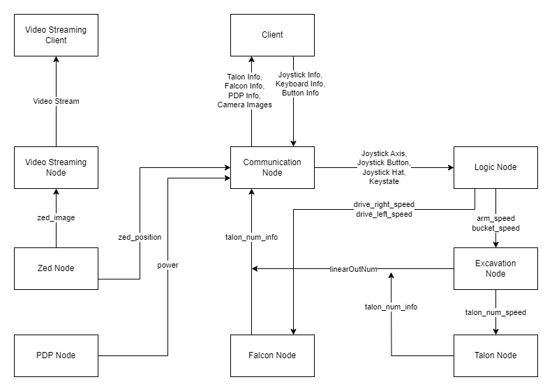

# Welcome to the Razorbotz NASA Lunabotics Project!
This page is intended to provide a starting point and overview of the project.  It is also a roadmap for how to get involved with the project, even if you aren't familiar with the code or technology stack. Please note that these links may not be up to date and any links should be followed at your own risk.  If you find any links that no longer work or changes that need to be made, please contact me at andrewburroughs17@gmail.com.  Click [here](https://razorbotz.github.io/ROS2/) to view the documentation for the project.  If you are not familiar with Github and the git cli, please refer to the [Razorbotz Github Intro page](https://github.com/Razorbotz/Test).

## Overview
* [Getting Started](https://github.com/Razorbotz/ROS2/tree/master#getting-started)
* [Understanding the Codebase](https://github.com/Razorbotz/ROS2/tree/master#understanding-the-codebase)

## Getting Started
To get started with the project, install the [virtual machine](https://github.com/Razorbotz/ROS2/tree/master#installing-ros2). Then after installing the virtual machine, go through these [Linux tutorials](https://www.hostinger.com/tutorials/linux-commands). The key objective of these tutorials is to teach how to navigate through the file structure via the terminal, as well manipulating files using commands. Because the robot is designed to be operated remotely on the lunar surface, understanding these commands is an essential skill for this project. 

## Understanding the Codebase
The codebase currently holds the code for the previous bots Skinny, Spinner, Scoop, and Shovel as well as the most recent bot.

### Structure of the packages
ROS2 packages all contain the following:
* src folder //contains the source code / node files
* CMakeLists.txt //Defines dependencies for cmake 
* package.xml //Defines dependencies for ROS2

The src folder within a package contains the .cpp files that define nodes and supporting files for classes/objects/functions relevant to that package.  To read more about ROS2 packages, please refer to the [ROS2 tutorial](https://docs.ros.org/en/foxy/Tutorials/Creating-Your-First-ROS2-Package.html).

The ROS2 packages currently in this project are as follows:
* [Communication](https://github.com/Razorbotz/ROS2/tree/master/shovel/src/communication2)
* [Excavation](https://github.com/Razorbotz/ROS2/tree/master/shovel/src/excavation)
* [Falcon](https://github.com/Razorbotz/ROS2/tree/master/shovel/src/falcon)
* [Logic](https://github.com/Razorbotz/ROS2/tree/master/shovel/src/logic)
* [Power Distribution Panel](https://github.com/Razorbotz/ROS2/tree/master/shovel/src/power_distribution_panel)
* [Talon](https://github.com/Razorbotz/ROS2/tree/master/shovel/src/talon)
* [Video Streaming](https://github.com/Razorbotz/ROS2/tree/master/shovel/video_streaming)
* [Zed Tracking](https://github.com/Razorbotz/ROS2/tree/master/shovel/src/zed)

All motor controller nodes, ie Talon, Falcon, and Exavation nodes, also subscribe to two publishers from the communication node that are called the GO and STOP publishers.  These subscriptions were omitted from the diagram for the sake of clarity.